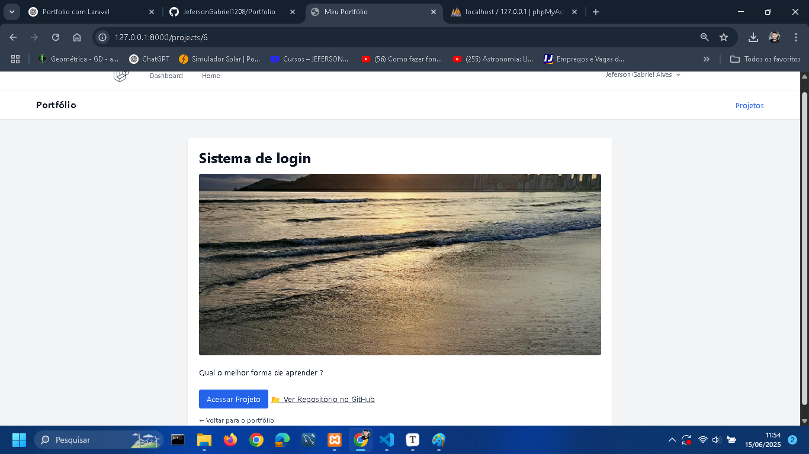
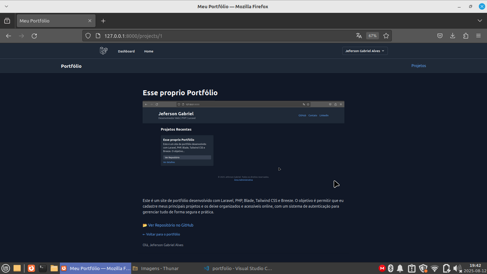
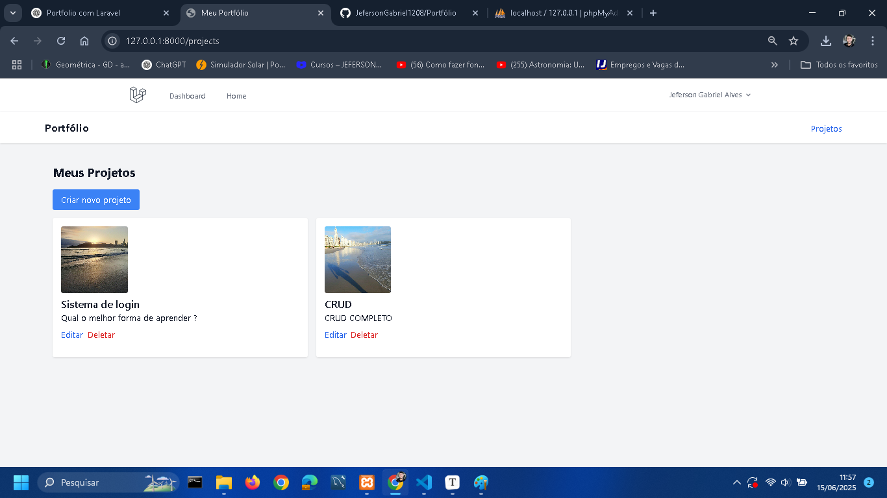
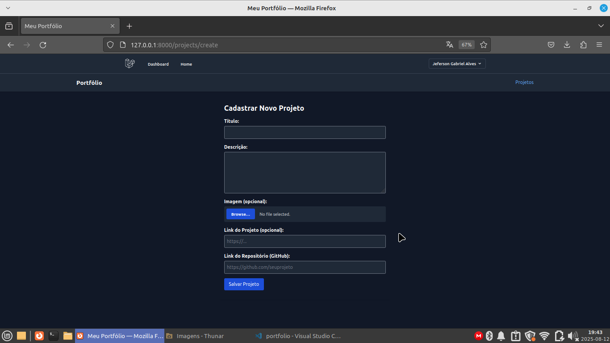
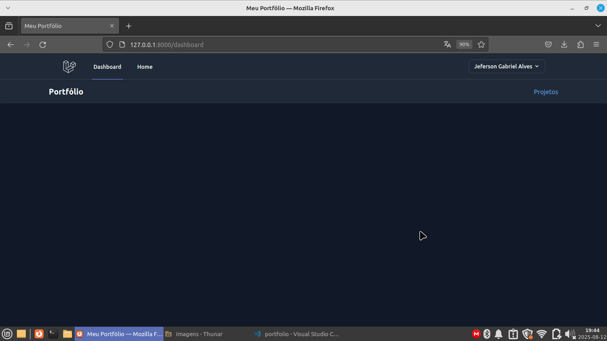

# 🚀 Portfólio Pessoal em Laravel 11

Projeto de portfólio pessoal desenvolvido com foco em conquistar a primeira vaga com PHP/Laravel. Inclui autenticação, CRUD com upload de imagem, link externo e GitHub.

---

## ✅ Tecnologias utilizadas

- PHP 8.2
- Laravel 11
- Laravel Breeze (login/cadastro)
- MySQL
- Blade (Laravel Views)
- Tailwind CSS
- Vite
- NPM

---

## 📌 Passo a passo do desenvolvimento

### 1. Criação do Projeto Laravel
```bash
composer create-project laravel/laravel portfolio
cd portfolio
```

### 2. Instalação do Breeze (Autenticação)
```bash
composer require laravel/breeze --dev
php artisan breeze:install blade
npm install
npm run dev
```

### 3. Configuração do Banco de Dados (.env)
```
DB_CONNECTION=mysql
DB_HOST=127.0.0.1
DB_PORT=3306
DB_DATABASE=portfolio
DB_USERNAME=root
DB_PASSWORD=
```
Criação do banco via phpMyAdmin e depois:
```bash
php artisan migrate
```

### 4. Criar Model, Controller e Migration para Projetos
```bash
php artisan make:model Project -m
php artisan make:controller ProjectController --resource
```

### 5. Estrutura da tabela (Migration)
- title (string)
- description (text)
- image (string, nullable)
- url (string, nullable)
- github_url (string, nullable)
```bash
php artisan migrate
```

### 6. Criar Rotas no web.php
- Rotas públicas para home
- Rotas protegidas para CRUD de projetos (usando middleware auth)
- Route resource para ProjectController

### 7. Criar as Views Blade
- `home.blade.php`
- `projects/index.blade.php`
- `projects/create.blade.php`
- `projects/edit.blade.php`
- `projects/show.blade.php`

### 8. Implementar os Métodos no Controller
- index()
- create()
- store()
- edit()
- update()
- destroy()
- show()

Incluindo upload de imagens, validação e manipulação de arquivos.

### 9. Melhorar a Dashboard (Área Administrativa)
Arquivo: `resources/views/dashboard.blade.php`

Adicionamos links úteis:
- Criar Projeto
- Listar Projetos
- Voltar ao Portfólio Público

### 10. Limpar Cache de Views (se necessário)
```bash
php artisan view:clear
```

### 11. Rodar Build de Produção
```bash
npm run build
```

### 12. Versionamento no GitHub
```bash
git init
git add .
git commit -m "Projeto Portfólio Laravel finalizado"
git branch -M main
git remote add origin https://github.com/SEU_USUARIO/portfolio-laravel.git
git push -u origin main
```

### 13. Adicionar README com prints
- Criar pasta `prints/`
- Colocar imagens das telas
- Referenciar no README conforme abaixo:

---

## 🎨 Prints de tela:

### Página Inicial (Home)


### Página de Detalhes (Show)


### Listagem de Projetos (Admin)


### Cadastro de Projeto


### Dashboard após Login


---

## ✅ Status Final
✔️ CRUD completo  
✔️ Upload de imagens  
✔️ Link externo e GitHub nos projetos  
✔️ Área pública + administrativa  
✔️ Pronto para apresentação  

---

**Desenvolvido por:** Jeferson Gabriel
